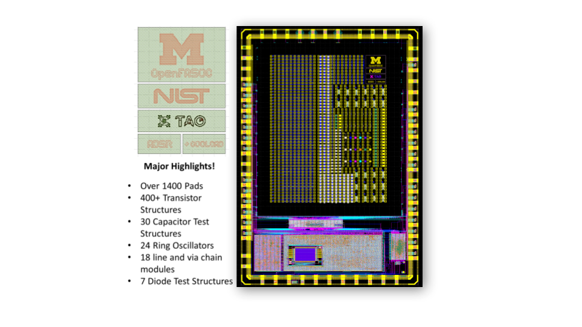
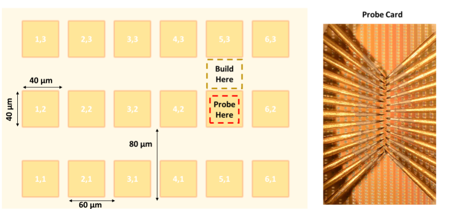
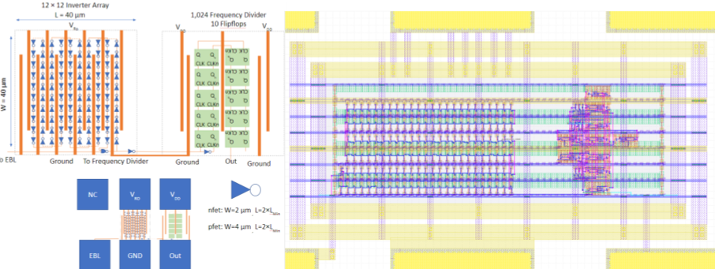
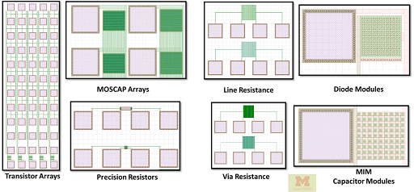

`sky130-raw-data` - Raw data collected about the SKY130 process technology
==========================================================================

This repository contains the raw data that has been collected about SkyWater's 130nm bulk process technology to help validate the `fully open source, manufacturable, SK130 PDK that Google maintains <https://github.com/google/skywater-pdk>`_.

The initial data that is available in this repository was collected under contract by `CoolCAD Electronics LLC <https://coolcadelectronics.com/>`_ using the manufacturing test tile created by SkyWater. It is expected that more data will be added to this repository as other groups start to also collect experimental data.

Experimental Data
=================

The experimental data in this repository is currently stored in the `.mdm` file format.

**Current** proprietary SkyWater Test Tile
------------------------------------------

Documentation about the existing proprietary test tile can be found in the `docs/sky130-testtile directory <./docs/sky130-testtile>`_.

**Future** fully open source Test Tile
--------------------------------------

Google, NIST, and University of Michigan are working together to create a fully open test tile design using the `OpenFASoC generator approach <https://github.com/idea-fasoc/OpenFASOC>`_ and open source tooling. More details can be found at the following links;

* Test Interface

* `GitHub repository with OpenFASoC Ring Oscillators generator <https://github.com/idea-fasoc/OpenFASOC/tree/main/openfasoc/generators/cryo-gen>`_

sky130_fd_sc_hd, sky130_fd_sc_hs, sky130_fd_sc_hvl based ring osc.
+ 
9 additional OSU standard cell ring osc. : 12T_hs, 12T_ms, 15T_hs, 15T_ls, 15T_ms, 18T_hs, 18T_ls, 18T_ms

.. image:: docs/sky130-testtile/ROs.png
   :width: 80%
   :align: center
   :alt: Ring Osc. structures.

More details about the ring oscillators generator can be found `here <https://docs.google.com/presentation/d/1oROHp4B55McL_V3XpsjWqH9fspBz7vrPsw5zF5Ex_8M>`_.

* gdsfactory based generators which includes line and via chain resitance, MIM capacitor modules, diodes modules, etc..

* `GitHub repository with line resitance via chain generator <https://github.com/idea-fasoc/OpenFASOC/tree/main/openfasoc/generators/gdsfactory-gen/line-res_via-chain>`_
* `GitHub repository with MIM cap. array generator <https://github.com/idea-fasoc/OpenFASOC/tree/main/openfasoc/generators/gdsfactory-gen/mimcap-array>`_

The first test version of this tile was included in the MPW-5 run and can be found at;

* `GitHub repository with design <https://github.com/msaligane/openfasoc_cryo_caravel>`_
* `Efabless Submission <https://platform.efabless.com/projects/741>`_
* `Final GDS submitted to SkyWater <https://foss-eda-tools.googlesource.com/third_party/shuttle/mpw-five/slot-016/>`_

MDM File Format
---------------

A description of the MDM file format `can be found here. <https://people.ece.ubc.ca/robertor/Links_files/Files/ICCAP-2008-doc/icug/icug136.html>`_

.. image:: docs/_static/mdm-format.png
   :width: 80%
   :align: center
   :alt: Image describing the various parts of the MDM file.

Contributing
============

If you have the facilities to do silicon measurement and are interested in contributing, please send `Tim 'mithro' Ansell <tansell@google.com> an email <mailto:tansell@google.com>`_ to request test tiles.

SKY130 Process Node
===================

The SKY130 is a mature 180nm-130nm hybrid technology originally developed internally by Cypress Semiconductor before being spun out into SkyWater Technology and made accessible to general industry. SkyWater and Google’s collaboration is now making this technology accessible to everyone!

The SKY130 Process node technology stack consists of;

* Support for internal 1.8V with 5.0V I/Os (operable at 2.5V)
* 1 level of local interconnect
* 5 levels of metal
* Is inductor-capable
* Has high sheet rho poly resistor
* Optional MiM capacitors
* Includes SONOS shrunken cell
* Supports 10V regulated supply
* HV extended-drain NMOS and PMOS

The `SKY130 Process Node`_ is an extremely flexible offering, including many normally *optional* features as standard (features like the local interconnect, SONOS functionality, MiM capacitors, and more). This provides the designer with a **wide range** of flexibility in design choices.

License
=======

The resources in this repository are released under the `Apache 2.0 license <https://github.com/google/skywater-pdk-sky130-raw-data/blob/master/LICENSE>`_.

The copyright details (which should also be found at the top of every file) are;

::

   Copyright 2022 SkyWater PDK Authors

   Licensed under the Apache License, Version 2.0 (the "License");
   you may not use this file except in compliance with the License.
   You may obtain a copy of the License at

       http://www.apache.org/licenses/LICENSE-2.0

   Unless required by applicable law or agreed to in writing, software
   distributed under the License is distributed on an "AS IS" BASIS,
   WITHOUT WARRANTIES OR CONDITIONS OF ANY KIND, either express or implied.
   See the License for the specific language governing permissions and
   limitations under the License.
