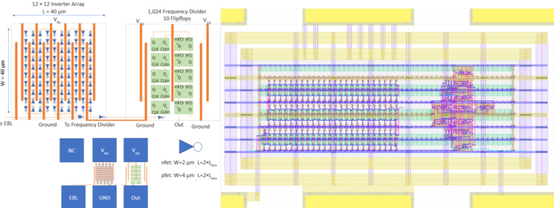

SkyWater 130nm Open Manufacturing Test Tile
===========================================

Google, NIST, and University of Michigan are working together to create a fully open test tile design using the `OpenFASoC generator approach <https://github.com/idea-fasoc/OpenFASOC>`_ and open source tooling.

.. image:: resultanttestdie.png
   :width: 80%
   :align: center
   :alt: Resultant test die from MPW-5.

* Test Interface

.. image:: testinterface.png
   :width: 70%
   :align: center
   :alt: Probing Card.

* `GitHub repository with OpenFASoC Ring Oscillators generator <https://github.com/idea-fasoc/OpenFASOC/tree/main/openfasoc/generators/cryo-gen>`_

sky130_fd_sc_hd, sky130_fd_sc_hs, sky130_fd_sc_hvl based ring osc.
+ 
9 additional OSU standard cell ring osc. : 12T_hs, 12T_ms, 15T_hs, 15T_ls, 15T_ms, 18T_hs, 18T_ls, 18T_ms

.. image:: ROs.png
   :width: 80%
   :align: center
   :alt: Ring Osc. structures.

More details about the ring oscillators generator can be found `here <https://docs.google.com/presentation/d/1oROHp4B55McL_V3XpsjWqH9fspBz7vrPsw5zF5Ex_8M>`_.

* gdsfactory based generators which includes line and via chain resitance, MIM capacitor modules, diodes modules, etc..

.. image:: gdsfactory-gen.png
   :width: 80%
   :align: center
   :alt: line and via resistance + cap. and diodes meshes.

* `GitHub repository with line resitance via chain generator <https://github.com/idea-fasoc/OpenFASOC/tree/main/openfasoc/generators/gdsfactory-gen/line-res_via-chain>`_
* `GitHub repository with MIM cap. array generator <https://github.com/idea-fasoc/OpenFASOC/tree/main/openfasoc/generators/gdsfactory-gen/mimcap-array>`_

The first test version of this tile was included in the MPW-5 run and can be found at;

* `GitHub repository with design <https://github.com/msaligane/openfasoc_cryo_caravel>`_
* `Efabless Submission <https://platform.efabless.com/projects/741>`_
* `Final GDS submitted to SkyWater <https://foss-eda-tools.googlesource.com/third_party/shuttle/mpw-five/slot-016/>`_

License
=======

The resources in this repository are released under the `Apache 2.0 license <https://github.com/google/skywater-pdk-sky130-raw-data/blob/master/LICENSE>`_.

The copyright details (which should also be found at the top of every file) are;

::

   Copyright 2022 SkyWater PDK Authors

   Licensed under the Apache License, Version 2.0 (the "License");
   you may not use this file except in compliance with the License.
   You may obtain a copy of the License at

       http://www.apache.org/licenses/LICENSE-2.0

   Unless required by applicable law or agreed to in writing, software
   distributed under the License is distributed on an "AS IS" BASIS,
   WITHOUT WARRANTIES OR CONDITIONS OF ANY KIND, either express or implied.
   See the License for the specific language governing permissions and
   limitations under the License.
