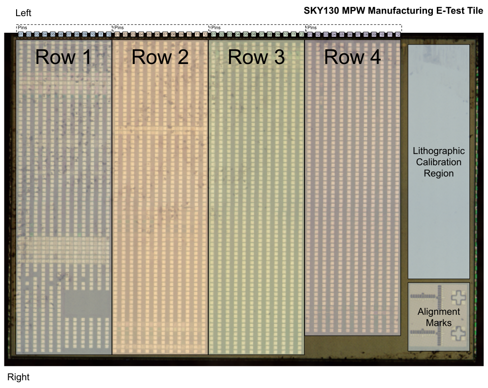

SkyWater 130nm Proprietary Manufacturing Test Tile
==================================================

To enable experimental validation and characterization of SkyWater's 130nm bulk process technology to help validate the `fully open source, manufacturable, SK130 PDK that Google maintains <https://github.com/google/skywater-pdk>`_ each of the Google MPW runs includes two copies of a "manufacturing test tile".

The test tile consists of a grid of probe points as seen below;

Documentation about the probe points can be found at https://bit.ly/sky130-testtile-edit with read only copies also stored in this directory.

* `Pad documentation spreadsheet (in OpenDocument Spreadsheet Document format) <./sky130-testtile-pad-documentation.ods>`_
* `Pad documentation spreadsheet (in PDF format) <./sky130-testtile-pad-documentation.pdf>`_
* `Pad documentation spreadsheet (in machine readable CSV format) <./sky130-testtile-pad-documentation.csv>`_

The schematics and layout of the circuits connected to these probe points are **not** currently available. However, with SkyWater's approval, a number of community members `are working to create public documentation <https://bit.ly/sky130-mpw1-testtile-notes>`_.

Replacement Open Source Tile
============================

Google, NIST, and University of Michigan are working together to create a fully open test tile design using the `OpenFASoC generator approach <https://github.com/idea-fasoc/OpenFASOC>`_ and open source tooling. More information can be found in the `README.rst in the raw data repository @ https://github.com/google/skywater-pdk-sky130-raw-data <https://github.com/google/skywater-pdk-sky130-raw-data>`_.

License
=======

The resources in this repository are released under the `Apache 2.0 license <https://github.com/google/skywater-pdk-sky130-raw-data/blob/master/LICENSE>`_.

The copyright details (which should also be found at the top of every file) are;

::

   Copyright 2022 SkyWater PDK Authors

   Licensed under the Apache License, Version 2.0 (the "License");
   you may not use this file except in compliance with the License.
   You may obtain a copy of the License at

       http://www.apache.org/licenses/LICENSE-2.0

   Unless required by applicable law or agreed to in writing, software
   distributed under the License is distributed on an "AS IS" BASIS,
   WITHOUT WARRANTIES OR CONDITIONS OF ANY KIND, either express or implied.
   See the License for the specific language governing permissions and
   limitations under the License.
